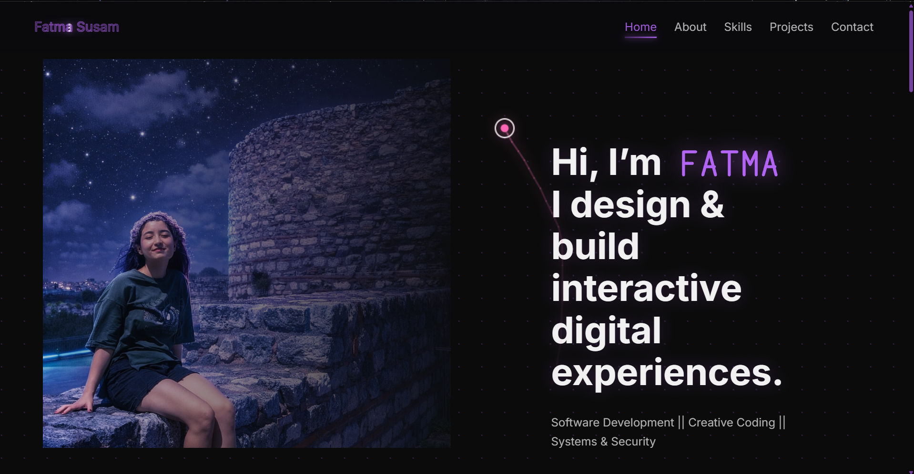

# myPortfolio || 🌙 Fatma Susam

  

 

Hey! I’m Fatma 👋  
I’m an Information Systems Engineering student with a strong interest in building interactive, meaningful digital experiences.

This repository contains my personal portfolio website, where I showcase my projects, experiments, and the areas I’m currently exploring.

---

## ✨ About Me

- 🎓 Information Systems Engineering student at Muğla Sıtkı Koçman University  
- 💻 Background in Software Development (vocational high school)  
- 🌱 Constantly learning through Udemy courses, bootcamps, and hands-on workshops  
- 🎮 Curious about game development, interactive systems, and creative coding  
- 🧠 Interested in backend logic, data, systems, and security fundamentals  

I value **clean, readable code**, **strong visual identity**, and **thoughtful user interactions** over purely static designs.

---

## 🛠️ Technologies & Interests

- **Frontend:** HTML, CSS, JavaScript  
- **Backend:** API integration, server-side logic (learning & improving)
- **Data:** Data modeling, basic analysis, data-driven thinking  
- **Design:** Clean UX, interactive UI, creative coding
- **Other Interests:**  
  - Game Development  
  - Machine Learning (foundations)  
  - Systems & Security  

---

## 🌷 Featured Concepts

- Interactive web experiences  
- Scroll-based and motion-driven UI  
- Creative visual experiments  
- Learning-focused projects  

Some parts of this portfolio are experimental by design — I enjoy exploring ideas and improving them step by step.

---

## 🚀 Live Demo

👉 **Portfolio Website:**  
[https://fatmassm.github.io/myPortfolio](https://fatmassm.github.io/myPortfolio)

---

## 📬 Contact

Feel free to reach out or explore my work:

- GitHub: [fatmaSsm](https://github.com/fatmassm)

---

## 👩‍💻 Author
- fatmaSsm
